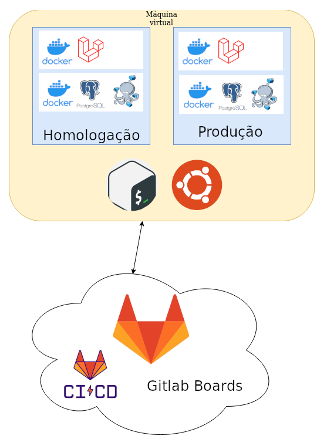

# GCS - Controle financeiro

Este projeto foi desenvolvido para o componente de Gerência de configuração de software da graduação de Engenharia de Software na Univates.

## Tarefa

Criar uma aplicação simples de gerenciamento financeiro.

Configurar um ambiente de produção de software que contemple todo o pipeline do
processo, contendo as seguintes fases:

A) Registro da mudança

B) Implementação

C) Versionamento

D) Testes automatizados

◦ 20 testes

◦ Controlar e exibir estatísticas de execução dos testes

E) Transferência para o ambiente de Homologação

F) Transferência para o ambiente de Produção

## Arquitetura

* Sistema Operacional: Ubuntu
* Linguagem de programação: PHP
* Banco de dados: PostgreSQL
* Ferramenta para Controle de Mudança: Gitlab (boards, issues)
* Ferramenta de Versionamento: Git (Gitlab)
* Ferramenta de Integração: Gitlab CI/CD
* Ferramenta de Testes: PHPUnit
* Demais ferramentas: Laravel, SSH, Docker e Docker Compose.
